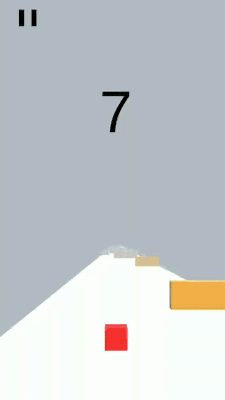
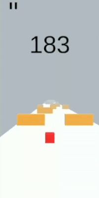

# Cube

Cube is my first mobile game developed with Unity engine and C#. The core of the game has been made after watching [this](https://www.youtube.com/watch?v=j48LtUkZRjU&list=PLPV2KyIb3jR53Jce9hP7G5xC4O9AgnOuL) youtube series from Brackeys. After finishing the tutorial, I decided my game would have and endless behaivour, so I implemented the continuous generation of the terrain along with randomnizing the appearence of the obstacles.

# Content
* Score system
* Endless game (as long as you keep avoiding obstacles 😊)
* Game restarts if you colide against an obstacle or if you fall form the platform
* Pause/Play option (in case you want to rest for a while)
* Efficient object generation/destruction

